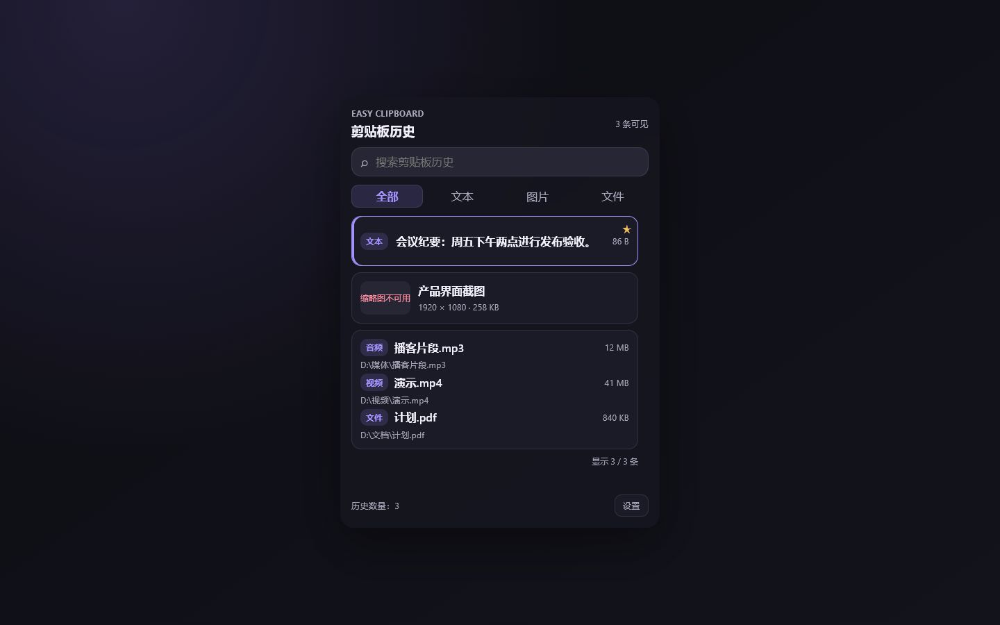

# Easy Clipboard

<p align="center"></p>

Easy Clipboard is a local-first Windows clipboard history manager. It keeps text, images and file collections ready to find and paste without sending clipboard contents to a service.

<p align="center"></p>

## Features and supported formats

- Searchable history for plain text, rich text, PNG images and copied files.
- File cards distinguish audio, video and other files; unavailable files are clearly disabled.
- Favorites, type filters, keyboard selection, context actions and system-tray controls.
- Aurora light and Ink dark themes, optional startup launch, and a fixed policy of 100 regular items plus 20 favorites.

## Install and use

Download `Easy-Clipboard_0.1.0_x64-setup.exe` from the release, then run it. Windows may show a SmartScreen warning because this publisher is not code-signed; inspect the download and SHA-256 before choosing **More info → Run anyway**. To uninstall, use **Installed apps → Easy Clipboard → Uninstall**.

The default shortcut is `Ctrl+Shift+V`. Click a card to paste it into the previously focused application; right-click a card for copy, favorite, delete or reveal actions. Easy Clipboard records the focused target before showing its window and restores focus before pasting, so a paste is directed to the app you were using rather than the clipboard window.

The default per-item limit is **50 MB**; it can be raised to **500 MB** in Settings.

## Privacy and data

Clipboard history stays on this device. On Windows, application data is stored under `%APPDATA%\\com.kyaru-momochi.easy-clipboard` (including its local SQLite history and cached image assets). The installed application itself is under `%LOCALAPPDATA%\\Easy Clipboard`. Clear history from Settings when needed.

## Development

Prerequisites: Windows 10/11, Node.js 24+, Rust stable with the MSVC toolchain, and the Visual Studio C++ build tools.

```powershell
npm ci
npm run dev
npm test
npm run check
npm run tauri build -- --bundles nsis
```

The Svelte 5/Vite frontend presents the history and settings UI. Tauri 2 hosts it; Rust owns clipboard capture, Windows focus-safe paste, SQLite persistence, tray controls and native settings. The `src/lib` layer invokes typed Tauri commands, while `src-tauri/src` contains the domain, platform adapters and storage implementation.

## Test, build and verify

Run the commands above for frontend checks and tests. The release workflow packages a Windows x64 NSIS installer. Verify a downloaded release in PowerShell:

```powershell
Get-FileHash .\Easy-Clipboard_0.1.0_x64-setup.exe -Algorithm SHA256
Get-Content .\Easy-Clipboard_0.1.0_x64-setup.exe.sha256
```

## Roadmap and contributing

Planned work includes richer previews, accessibility refinements and more capture controls. Contributions are welcome: open an issue describing the change, add focused tests, and keep changes scoped.

## License

This repository currently has no top-level license file; no specific license is asserted here. See [THIRD_PARTY_NOTICES.md](THIRD_PARTY_NOTICES.md) for dependency notices.
